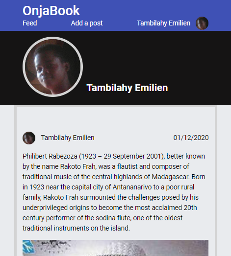

# Onjabook : Facebook clone

## Statement

### We’re going to build a Facebook clone called OnjaBook.

It will contain 3 pages : Feed, Add a post, options.

Feed page: It’s where I see a few posts. I can like a post, and post a comment on it.

Add a post: It’s a simple form page where I can create a new post!

Options : It’s a page where I can update a simple profile.

Tech requirements :

- There should be a global context state, handled with a reducer
- The post components needs to be a Compound Component
Feel free to update the styles as you want, but focus on the functional requirements first.

Send me the github link and netlify link when it’s done.

Happy coding!

Report

## Overview

In the future, there will be some documentation here. Wait and see 👀